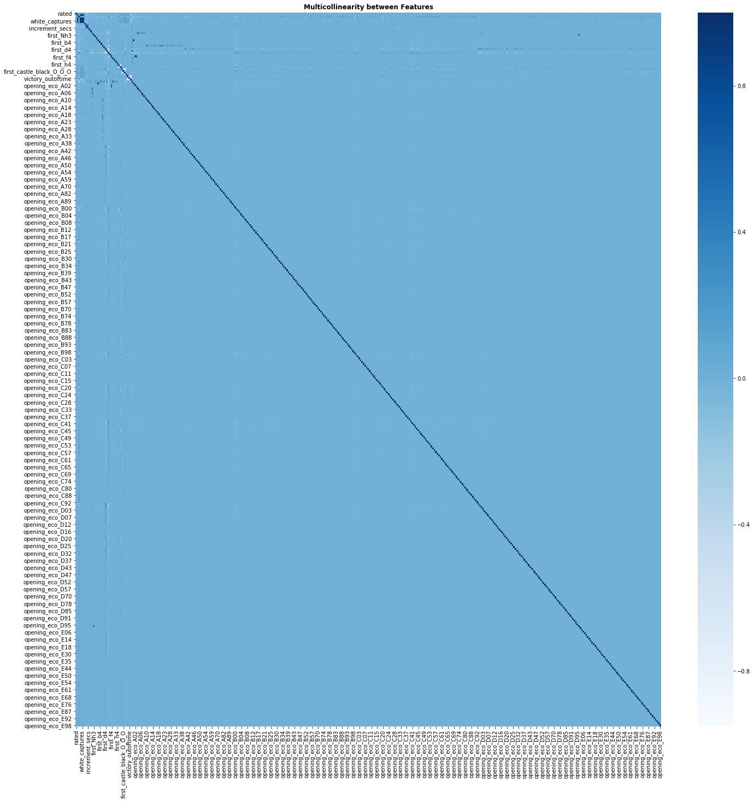

<h1>Table of Contents<span class="tocSkip"></span></h1>
<div class="toc"><ul class="toc-item"><li><span><a href="#Project-Overview:" data-toc-modified-id="Project-Overview:-1"><span class="toc-item-num">1&nbsp;&nbsp;</span>Project Overview:</a></span></li><li><span><a href="#Obtain-Data-/-Import-Libraries:" data-toc-modified-id="Obtain-Data-/-Import-Libraries:-2"><span class="toc-item-num">2&nbsp;&nbsp;</span>Obtain Data / Import Libraries:</a></span></li><li><span><a href="#Pre-process-/-Scrub-Data:" data-toc-modified-id="Pre-process-/-Scrub-Data:-3"><span class="toc-item-num">3&nbsp;&nbsp;</span>Pre-process / Scrub Data:</a></span></li><li><span><a href="#Data-Exploration-/-Analysis:" data-toc-modified-id="Data-Exploration-/-Analysis:-4"><span class="toc-item-num">4&nbsp;&nbsp;</span>Data Exploration / Analysis:</a></span><ul class="toc-item"><li><span><a href="#Feature-Engineering:" data-toc-modified-id="Feature-Engineering:-4.1"><span class="toc-item-num">4.1&nbsp;&nbsp;</span>Feature Engineering:</a></span></li><li><span><a href="#One-Hot-Encoding:" data-toc-modified-id="One-Hot-Encoding:-4.2"><span class="toc-item-num">4.2&nbsp;&nbsp;</span>One-Hot-Encoding:</a></span></li><li><span><a href="#Define-Features,-Target:" data-toc-modified-id="Define-Features,-Target:-4.3"><span class="toc-item-num">4.3&nbsp;&nbsp;</span>Define Features, Target:</a></span></li><li><span><a href="#Evaluating-Multicollinearity:" data-toc-modified-id="Evaluating-Multicollinearity:-4.4"><span class="toc-item-num">4.4&nbsp;&nbsp;</span>Evaluating Multicollinearity:</a></span></li></ul></li><li><span><a href="#Modeling:" data-toc-modified-id="Modeling:-5"><span class="toc-item-num">5&nbsp;&nbsp;</span>Modeling:</a></span><ul class="toc-item"><li><span><a href="#Pruning" data-toc-modified-id="Pruning-5.1"><span class="toc-item-num">5.1&nbsp;&nbsp;</span>Pruning</a></span></li><li><span><a href="#ROC/AUC:" data-toc-modified-id="ROC/AUC:-5.2"><span class="toc-item-num">5.2&nbsp;&nbsp;</span>ROC/AUC:</a></span></li><li><span><a href="#Decision-Tree:" data-toc-modified-id="Decision-Tree:-5.3"><span class="toc-item-num">5.3&nbsp;&nbsp;</span>Decision Tree:</a></span><ul class="toc-item"><li><span><a href="#Gini" data-toc-modified-id="Gini-5.3.1"><span class="toc-item-num">5.3.1&nbsp;&nbsp;</span>Gini</a></span></li><li><span><a href="#Entropy:" data-toc-modified-id="Entropy:-5.3.2"><span class="toc-item-num">5.3.2&nbsp;&nbsp;</span>Entropy:</a></span></li></ul></li><li><span><a href="#Decision-Tree-Pruning-and-Hyper-Parameter-Optimization:" data-toc-modified-id="Decision-Tree-Pruning-and-Hyper-Parameter-Optimization:-5.4"><span class="toc-item-num">5.4&nbsp;&nbsp;</span>Decision Tree Pruning and Hyper-Parameter Optimization:</a></span></li><li><span><a href="#Using-Pipelines/GridSearch-to-tune-additional-models:" data-toc-modified-id="Using-Pipelines/GridSearch-to-tune-additional-models:-5.5"><span class="toc-item-num">5.5&nbsp;&nbsp;</span>Using Pipelines/GridSearch to tune additional models:</a></span><ul class="toc-item"><li><span><a href="#Random-Forest:" data-toc-modified-id="Random-Forest:-5.5.1"><span class="toc-item-num">5.5.1&nbsp;&nbsp;</span>Random Forest:</a></span></li><li><span><a href="#Adaboosting:" data-toc-modified-id="Adaboosting:-5.5.2"><span class="toc-item-num">5.5.2&nbsp;&nbsp;</span>Adaboosting:</a></span></li><li><span><a href="#Bagging:" data-toc-modified-id="Bagging:-5.5.3"><span class="toc-item-num">5.5.3&nbsp;&nbsp;</span>Bagging:</a></span></li></ul></li></ul></li><li><span><a href="#Evaluation:" data-toc-modified-id="Evaluation:-6"><span class="toc-item-num">6&nbsp;&nbsp;</span>Evaluation:</a></span></li></ul></div>

## Project Overview:

**Flatiron Module 3 Project:**
* Classification - Predicting the Winner of Chess Games
* Instructor: Rafael Carrasco
* Student: Paul Woody
* Cohort: 041519

For this project, we'll be seeking to create a classification model to predict the winner of chess games by exploring the features within [this](https://www.kaggle.com/datasnaek/chess) 20,000 game chess database. 

To complete our analysis, we will follow the OSEMN Data Science process as outlined [here](https://medium.com/breathe-publication/life-of-data-data-science-is-osemn-f453e1febc10).

## Obtain Data / Import Libraries:

To begin our analysis, we will first load the dataset and preview its contents. As we peruse the features of the dataset, we'll first pre-process the data, ensuring that any missing/null values are handled appropriately, and that dataset features are stored as the correct dtypes.


```python
df = pd.read_csv('games.csv')
```

## Pre-process / Scrub Data:


```python
print(df.columns)
print('')
print(df.info())
print('')
print(df.describe())
print('')
print('Missing Values?')
print(df.isna().any().any())
print('Null Values?')
print(df.isnull().any().any())
df.head(3)
```

    Index(['id', 'rated', 'created_at', 'last_move_at', 'turns', 'victory_status',
           'winner', 'increment_code', 'white_id', 'white_rating', 'black_id',
           'black_rating', 'moves', 'opening_eco', 'opening_name', 'opening_ply'],
          dtype='object')
    
    <class 'pandas.core.frame.DataFrame'>
    RangeIndex: 20058 entries, 0 to 20057
    Data columns (total 16 columns):
    id                20058 non-null object
    rated             20058 non-null bool
    created_at        20058 non-null float64
    last_move_at      20058 non-null float64
    turns             20058 non-null int64
    victory_status    20058 non-null object
    winner            20058 non-null object
    increment_code    20058 non-null object
    white_id          20058 non-null object
    white_rating      20058 non-null int64
    black_id          20058 non-null object
    black_rating      20058 non-null int64
    moves             20058 non-null object
    opening_eco       20058 non-null object
    opening_name      20058 non-null object
    opening_ply       20058 non-null int64
    dtypes: bool(1), float64(2), int64(4), object(9)
    memory usage: 2.3+ MB
    None
    
             created_at  last_move_at         turns  white_rating  black_rating  \
    count  2.005800e+04  2.005800e+04  20058.000000  20058.000000  20058.000000   
    mean   1.483617e+12  1.483618e+12     60.465999   1596.631868   1588.831987   
    std    2.850151e+10  2.850140e+10     33.570585    291.253376    291.036126   
    min    1.376772e+12  1.376772e+12      1.000000    784.000000    789.000000   
    25%    1.477548e+12  1.477548e+12     37.000000   1398.000000   1391.000000   
    50%    1.496010e+12  1.496010e+12     55.000000   1567.000000   1562.000000   
    75%    1.503170e+12  1.503170e+12     79.000000   1793.000000   1784.000000   
    max    1.504493e+12  1.504494e+12    349.000000   2700.000000   2723.000000   
    
            opening_ply  
    count  20058.000000  
    mean       4.816981  
    std        2.797152  
    min        1.000000  
    25%        3.000000  
    50%        4.000000  
    75%        6.000000  
    max       28.000000  
    
    Missing Values?
    False
    Null Values?
    False


<div>
<style scoped>
    .dataframe tbody tr th:only-of-type {
        vertical-align: middle;
    }

    .dataframe tbody tr th {
        vertical-align: top;
    }

    .dataframe thead th {
        text-align: right;
    }
</style>
<table border="1" class="dataframe">
  <thead>
    <tr style="text-align: right;">
      <th></th>
      <th>id</th>
      <th>rated</th>
      <th>created_at</th>
      <th>last_move_at</th>
      <th>turns</th>
      <th>victory_status</th>
      <th>winner</th>
      <th>increment_code</th>
      <th>white_id</th>
      <th>white_rating</th>
      <th>black_id</th>
      <th>black_rating</th>
      <th>moves</th>
      <th>opening_eco</th>
      <th>opening_name</th>
      <th>opening_ply</th>
    </tr>
  </thead>
  <tbody>
    <tr>
      <th>0</th>
      <td>TZJHLljE</td>
      <td>False</td>
      <td>1.504210e+12</td>
      <td>1.504210e+12</td>
      <td>13</td>
      <td>outoftime</td>
      <td>white</td>
      <td>15+2</td>
      <td>bourgris</td>
      <td>1500</td>
      <td>a-00</td>
      <td>1191</td>
      <td>d4 d5 c4 c6 cxd5 e6 dxe6 fxe6 Nf3 Bb4+ Nc3 Ba5...</td>
      <td>D10</td>
      <td>Slav Defense: Exchange Variation</td>
      <td>5</td>
    </tr>
    <tr>
      <th>1</th>
      <td>l1NXvwaE</td>
      <td>True</td>
      <td>1.504130e+12</td>
      <td>1.504130e+12</td>
      <td>16</td>
      <td>resign</td>
      <td>black</td>
      <td>5+10</td>
      <td>a-00</td>
      <td>1322</td>
      <td>skinnerua</td>
      <td>1261</td>
      <td>d4 Nc6 e4 e5 f4 f6 dxe5 fxe5 fxe5 Nxe5 Qd4 Nc6...</td>
      <td>B00</td>
      <td>Nimzowitsch Defense: Kennedy Variation</td>
      <td>4</td>
    </tr>
    <tr>
      <th>2</th>
      <td>mIICvQHh</td>
      <td>True</td>
      <td>1.504130e+12</td>
      <td>1.504130e+12</td>
      <td>61</td>
      <td>mate</td>
      <td>white</td>
      <td>5+10</td>
      <td>ischia</td>
      <td>1496</td>
      <td>a-00</td>
      <td>1500</td>
      <td>e4 e5 d3 d6 Be3 c6 Be2 b5 Nd2 a5 a4 c5 axb5 Nc...</td>
      <td>C20</td>
      <td>King's Pawn Game: Leonardis Variation</td>
      <td>3</td>
    </tr>
  </tbody>
</table>
</div>


As seen above, there are no missing values in the dataset.

## Data Exploration / Analysis:

Taking a closer look at the 'moves' feature in the dataset, we can observe that the column contains the complete set of moves for each Chess game, stored as strings.

### Feature Engineering:

Here's an example of the recorded moves for a Chess game from the dataset:
```
'd4 d5 c4 c6 cxd5 e6 dxe6 fxe6 Nf3 Bb4+ Nc3 Ba5 Bf4'
```

At first consideration, this feature doesn't appear to possess much value as a predictor, as there are trillions of potential combinations of Chess moves that can produce a completed game. However, applying a modest amount of Chess know-how, we can put this feature to work in a big way through feature engineering.

Since we know that white always moves first, by splitting the moves column into individual moves (as elements of a list), we can determine that every odd element represents a move made by white. From there, we're able to continue to produce new features based what moves are made, and when. For example, castling is a move that can be made in special circumstances. For the purposes of our analysis, these circumstances are unimportant. What is important to know is that castling helps to protect the King, and that by making the decision to castle earlier, one has less potential to fall victim to enemy attacks.

Since we're pretty sure that castling early (a fundamental theory of Chess) is a good thing, we can determine which player castled first by searching for the index of its notation within our newly manipulated 'moves' column.

We'll use this same strategy to engineer other features as well, such as counting the number of enemy pieces captured by each player and calculating the difference in player rating between white and black.


```python
def first_capture(moves):
    for index, move in enumerate(moves.split()):
        if 'x' in move:
            if index%2==0:
                return 'white'
            else:
                return 'black'
    return None


def count_captures(moves):
    white_captures = 0
    black_captures = 0
    for index, move in enumerate(moves.split()):
        if 'x' in move:
            if index%2 == 0:
                white_captures += 1
            else:
                black_captures += 1
    return white_captures + black_captures

def white_captures(moves):
    white_captures = 0
    black_captures = 0
    for index, move in enumerate(moves.split()):
        if 'x' in move:
            if index%2 == 0:
                white_captures += 1
            else:
                black_captures += 1
    return white_captures

def black_captures(moves):
    white_captures = 0
    black_captures = 0
    for index, move in enumerate(moves.split()):
        if 'x' in move:
            if index%2 == 0:
                white_captures += 1
            else:
                black_captures += 1
    return black_captures

def count_n_captures(moves, n=3):
    white_captures = 0
    black_captures = 0
    for index, move in enumerate(moves.split()):
        if 'x' in move:
            if index%2 == 0:
                white_captures += 1
            else:
                black_captures += 1
        if white_captures == n or black_captures == n:
            return 'white' if white_captures == n else 'black'
        
def first_castle(moves):
    for index, move in enumerate(moves.split()):
        if move in ('O-O', 'O-O-O'):
            color = 'white' if index%2==0 else 'black'
            return '{}_{}'.format(color, move.replace("-", "_"))
    return None 

def display_acc_and_f1_score(true, preds, model_name):
    acc = accuracy_score(true, preds)
    f1 = f1_score(true, preds)
    print("Model: {}".format(model_name))
    print("Accuracy: {}".format(acc))
    print("F1-Score: {}".format(f1))
    
def plot_confusion_matrix(cm, classes,
                          normalize=False,
                          title='Confusion matrix',
                          cmap=plt.cm.Blues):
    # Check if Normalization Option is Set to True. 
    # If so, normalize the raw confusion matrix before visualizing
    if normalize:
        cm = cm.astype('float') / cm.sum(axis=1)[:, np.newaxis]
        print("Normalized Confusion Matrix")
    else:
        print('Confusion Matrix, without Normalization')
        
    # Print CNF Matrix
    print(cm)
    
    # Create the Matrix
    plt.imshow(cm, interpolation='nearest', cmap=cmap)
    
    # Add Title, Axis Labels:
    # . classes = class_names
    plt.title(title)
    plt.colorbar()
    tick_marks = np.arange(len(classes))
    plt.xticks(tick_marks, classes, rotation=45)
    plt.yticks(tick_marks, classes)
    
    # Add cell labels:
    fmt = '.2f' if normalize else 'd'
    thresh = cm.max() / 2.
    for i, j in itertools.product(range(cm.shape[0]), range(cm.shape[1])):
        plt.text(j, i, format(cm[i, j], fmt),
                 horizontalalignment="center",
                 color="white" if cm[i, j] > thresh else "black")

    plt.ylabel('True Label')
    plt.xlabel('Predicted Label')
    plt.tight_layout()    

def make_features(df, n):
    df['first_capture'] = df['moves'].apply(first_capture)
    df['count_captures'] = df['moves'].apply(count_captures)
    df['white_captures'] = df['moves'].apply(white_captures)
    df['black_captures'] = df['moves'].apply(black_captures)
    n_captures = [count_n_captures(move, n) for move in df['moves']]
    df[f'count_{n}_captures'] = n_captures
    df['first_castle'] = df['moves'].apply(first_castle)
    return df
```


```python
df = make_features(df, n=5)
df.head(3)
```


<div>
<style scoped>
    .dataframe tbody tr th:only-of-type {
        vertical-align: middle;
    }

    .dataframe tbody tr th {
        vertical-align: top;
    }

    .dataframe thead th {
        text-align: right;
    }
</style>
<table border="1" class="dataframe">
  <thead>
    <tr style="text-align: right;">
      <th></th>
      <th>id</th>
      <th>rated</th>
      <th>created_at</th>
      <th>last_move_at</th>
      <th>turns</th>
      <th>victory_status</th>
      <th>winner</th>
      <th>increment_code</th>
      <th>white_id</th>
      <th>white_rating</th>
      <th>...</th>
      <th>moves</th>
      <th>opening_eco</th>
      <th>opening_name</th>
      <th>opening_ply</th>
      <th>first_capture</th>
      <th>count_captures</th>
      <th>white_captures</th>
      <th>black_captures</th>
      <th>count_5_captures</th>
      <th>first_castle</th>
    </tr>
  </thead>
  <tbody>
    <tr>
      <th>0</th>
      <td>TZJHLljE</td>
      <td>False</td>
      <td>1.504210e+12</td>
      <td>1.504210e+12</td>
      <td>13</td>
      <td>outoftime</td>
      <td>white</td>
      <td>15+2</td>
      <td>bourgris</td>
      <td>1500</td>
      <td>...</td>
      <td>d4 d5 c4 c6 cxd5 e6 dxe6 fxe6 Nf3 Bb4+ Nc3 Ba5...</td>
      <td>D10</td>
      <td>Slav Defense: Exchange Variation</td>
      <td>5</td>
      <td>white</td>
      <td>3</td>
      <td>2</td>
      <td>1</td>
      <td>None</td>
      <td>None</td>
    </tr>
    <tr>
      <th>1</th>
      <td>l1NXvwaE</td>
      <td>True</td>
      <td>1.504130e+12</td>
      <td>1.504130e+12</td>
      <td>16</td>
      <td>resign</td>
      <td>black</td>
      <td>5+10</td>
      <td>a-00</td>
      <td>1322</td>
      <td>...</td>
      <td>d4 Nc6 e4 e5 f4 f6 dxe5 fxe5 fxe5 Nxe5 Qd4 Nc6...</td>
      <td>B00</td>
      <td>Nimzowitsch Defense: Kennedy Variation</td>
      <td>4</td>
      <td>white</td>
      <td>5</td>
      <td>2</td>
      <td>3</td>
      <td>None</td>
      <td>None</td>
    </tr>
    <tr>
      <th>2</th>
      <td>mIICvQHh</td>
      <td>True</td>
      <td>1.504130e+12</td>
      <td>1.504130e+12</td>
      <td>61</td>
      <td>mate</td>
      <td>white</td>
      <td>5+10</td>
      <td>ischia</td>
      <td>1496</td>
      <td>...</td>
      <td>e4 e5 d3 d6 Be3 c6 Be2 b5 Nd2 a5 a4 c5 axb5 Nc...</td>
      <td>C20</td>
      <td>King's Pawn Game: Leonardis Variation</td>
      <td>3</td>
      <td>white</td>
      <td>17</td>
      <td>14</td>
      <td>3</td>
      <td>white</td>
      <td>None</td>
    </tr>
  </tbody>
</table>
<p>3 rows × 22 columns</p>
</div>


After our initial exploration of the dataset, we have a better understanding of the significance of each feature, but are not yet ready to begin modeling. Before testing feature multicollinearity and importance, let's first drop several columns that don't contain useful information. Additionally, in our set of 20,000 games, there are only 950 draws. Because of the relatively small sample size of the 'draw' event space, we'll discard all drawn games from the dataset before modeling.


### One-Hot-Encoding:

Next, we must one-hot-encode categorical features of the dataset (such as the first moves) in order to calculate their strengths as predictors for the outcome of a Chess game.


```python
# Creating Dummies and Dropping Columns:
first_move_dummies = pd.get_dummies(df.first_move, prefix = 'first')
df.drop(['first_move'], axis=1, inplace=True)
df.drop(['moves'], axis=1, inplace=True)
df = pd.concat([df, first_move_dummies], axis=1)

# Removing games with no pieces captured and creating dummies
df = df[df.first_capture != 'no']
first_capture_dummies = pd.get_dummies(df.first_capture, prefix = 'first_cap')
df = pd.concat([df, first_capture_dummies], axis=1)

#first_5_capture_dummies = pd.get_dummies(df.first_5_captures, prefix = 'first_5_cap')
#df = pd.concat([df, first_5_capture_dummies], axis=1)

first_castle_dummies = pd.get_dummies(df.first_castle, prefix = 'first_castle')
df.drop(['first_castle'], axis=1, inplace=True)
df = pd.concat([df, first_castle_dummies], axis=1)

victory_status_dummies = pd.get_dummies(df.victory_status, prefix='victory')
df = pd.concat([df, victory_status_dummies], axis=1)
df.drop(['victory_status'], axis=1, inplace=True)

opening_eco_dummies = pd.get_dummies(df.opening_eco, prefix='opening_eco')
df.drop(['opening_eco'], axis=1, inplace=True)
df = pd.concat([df, opening_eco_dummies], axis=1)

df.drop(['opening_name', 'increment_code'], axis=1, inplace=True)

df.head(3)
```


<div>
<style scoped>
    .dataframe tbody tr th:only-of-type {
        vertical-align: middle;
    }

    .dataframe tbody tr th {
        vertical-align: top;
    }

    .dataframe thead th {
        text-align: right;
    }
</style>
<table border="1" class="dataframe">
  <thead>
    <tr style="text-align: right;">
      <th></th>
      <th>rated</th>
      <th>turns</th>
      <th>winner</th>
      <th>white_rating</th>
      <th>black_rating</th>
      <th>opening_ply</th>
      <th>first_capture</th>
      <th>count_captures</th>
      <th>white_captures</th>
      <th>black_captures</th>
      <th>...</th>
      <th>opening_eco_E81</th>
      <th>opening_eco_E87</th>
      <th>opening_eco_E88</th>
      <th>opening_eco_E90</th>
      <th>opening_eco_E91</th>
      <th>opening_eco_E92</th>
      <th>opening_eco_E94</th>
      <th>opening_eco_E95</th>
      <th>opening_eco_E97</th>
      <th>opening_eco_E98</th>
    </tr>
  </thead>
  <tbody>
    <tr>
      <th>0</th>
      <td>0</td>
      <td>13</td>
      <td>white</td>
      <td>1500</td>
      <td>1191</td>
      <td>5</td>
      <td>white</td>
      <td>3</td>
      <td>2</td>
      <td>1</td>
      <td>...</td>
      <td>0</td>
      <td>0</td>
      <td>0</td>
      <td>0</td>
      <td>0</td>
      <td>0</td>
      <td>0</td>
      <td>0</td>
      <td>0</td>
      <td>0</td>
    </tr>
    <tr>
      <th>1</th>
      <td>1</td>
      <td>16</td>
      <td>black</td>
      <td>1322</td>
      <td>1261</td>
      <td>4</td>
      <td>white</td>
      <td>5</td>
      <td>2</td>
      <td>3</td>
      <td>...</td>
      <td>0</td>
      <td>0</td>
      <td>0</td>
      <td>0</td>
      <td>0</td>
      <td>0</td>
      <td>0</td>
      <td>0</td>
      <td>0</td>
      <td>0</td>
    </tr>
    <tr>
      <th>2</th>
      <td>1</td>
      <td>61</td>
      <td>white</td>
      <td>1496</td>
      <td>1500</td>
      <td>3</td>
      <td>white</td>
      <td>17</td>
      <td>14</td>
      <td>3</td>
      <td>...</td>
      <td>0</td>
      <td>0</td>
      <td>0</td>
      <td>0</td>
      <td>0</td>
      <td>0</td>
      <td>0</td>
      <td>0</td>
      <td>0</td>
      <td>0</td>
    </tr>
  </tbody>
</table>
<p>3 rows × 402 columns</p>
</div>


### Define Features, Target:

Now that we have completed feature engineering and explored the dataset, we are ready to define the features (X) and target (y) in preparation to fit our first model. In order to attempt to balance the effect that feature size might have on model-training, we'll also normalize dataset features.


```python
# Segment featues/target as X:
y = df[['winner']]
X = df.drop(['winner'], axis=1)

X.columns
```


    Index(['rated', 'turns', 'opening_ply', 'count_captures', 'white_captures',
           'black_captures', 'rating_difference', 'minutes', 'increment_secs',
           'first_Na3',
           ...
           'opening_eco_E81', 'opening_eco_E87', 'opening_eco_E88',
           'opening_eco_E90', 'opening_eco_E91', 'opening_eco_E92',
           'opening_eco_E94', 'opening_eco_E95', 'opening_eco_E97',
           'opening_eco_E98'],
          dtype='object', length=397)


```python
# Normalizing features:
for col in X.columns:
    X[col] = (X[col] - min(X[col])) / (max(X[col]) - min(X[col]))
```


### Evaluating Multicollinearity:

Before continuing, let's evaluate our features for Multicollinearity and determine which features will have the greatest significance to the target, the winner of the chess game. Because the model input currently contains 397 columns, it is highly likely that overfitting would highly skew the results of our classification models. To determine how best to proceed, let's review feature distribution as well as feature correlation.

```python
# Split the data into train and test sets.
X_train, X_test, y_train, y_test = train_test_split(X, y, test_size=.20)
```

```python
# Fit Logistic Regression model:
logreg = LogisticRegression(fit_intercept = False, C = 1e12, verbose=1) 
logreg.fit(X_train, y_train)

# Predict:
y_hat_test = logreg.predict(X_test)
y_hat_train = logreg.predict(X_train)
```

    [LibLinear]


```python
logreg.score(X_test, y_test), logreg.score(X_train, y_train)
```


    (0.8249607535321821, 0.833769462253042)


```python
cnf_matrix = confusion_matrix(y_hat_test, y_test)
print('Confusion Matrix:\n', cnf_matrix)
```

    Confusion Matrix:
     [[1482  341]
     [ 328 1671]]


```python
# Visualizing Normalized CNF Matrix:
class_names = set(y)

plt.figure()
plot_confusion_matrix(cnf_matrix, classes = class_names, normalize=True, title='Normed CNF Matrix')
plt.show()
```

    Normalized Confusion Matrix
    [[0.81294569 0.18705431]
     [0.16408204 0.83591796]]


```python
for col1 in X.columns:
    for col2 in X.columns:
        if col2 == col1:
            pass
        else:
            corr = np.corrcoef(X[col1], X[col2])[0][1]
            if corr > 0.20:
                print(col1, col2, corr)
```

    turns count_captures 0.902324632561528
    turns white_captures 0.8492617869860856
    turns black_captures 0.8552024322183666
    opening_ply first_e4 0.24756085059362945
    count_captures turns 0.902324632561528
    count_captures white_captures 0.9441999655760515
    count_captures black_captures 0.9447854648425917
    white_captures turns 0.8492617869860855
    white_captures count_captures 0.9441999655760516
    white_captures black_captures 0.7841343948308672
    black_captures turns 0.8552024322183666
    black_captures count_captures 0.9447854648425917
    black_captures white_captures 0.7841343948308672
    minutes increment_secs 0.46571018003737585
    increment_secs minutes 0.46571018003737585
    first_Nf3 opening_eco_A04 0.6000265044291428
    first_Nf3 opening_eco_A06 0.2632816802325545
    first_Nh3 opening_eco_E00 0.5267356758771649
    first_b3 opening_eco_A01 0.9595424101658202
    first_b4 opening_eco_A00 0.2696175939217139
    first_c3 opening_eco_A00 0.20820766220256123
    first_c4 opening_eco_A10 0.4146857390398746
    first_c4 opening_eco_A20 0.3696017169469554
    first_c4 opening_eco_A21 0.28796553245657647
    first_c4 opening_eco_A22 0.26754661937260565
    first_c4 opening_eco_A30 0.2183260503867397
    first_d3 opening_eco_A00 0.281123321708952
    first_d4 opening_eco_A40 0.31005757113836846
    first_d4 opening_eco_A45 0.2040856555769827
    first_d4 opening_eco_D00 0.3440924051917857
    first_e3 opening_eco_A00 0.5552735546429394
    first_e4 opening_ply 0.24756085059362945
    first_f4 opening_eco_A02 0.696376462366495
    first_f4 opening_eco_A03 0.651932296299007
    first_g3 opening_eco_A00 0.40238477499044895
    opening_eco_A00 first_b4 0.26961759392171397
    opening_eco_A00 first_c3 0.20820766220256123
    opening_eco_A00 first_d3 0.281123321708952
    opening_eco_A00 first_e3 0.5552735546429395
    opening_eco_A00 first_g3 0.4023847749904489
    opening_eco_A01 first_b3 0.9595424101658203
    opening_eco_A02 first_f4 0.6963764623664951
    opening_eco_A03 first_f4 0.651932296299007
    opening_eco_A04 first_Nf3 0.600026504429143
    opening_eco_A06 first_Nf3 0.2632816802325545
    opening_eco_A10 first_c4 0.41468573903987455
    opening_eco_A20 first_c4 0.3696017169469554
    opening_eco_A21 first_c4 0.28796553245657647
    opening_eco_A22 first_c4 0.26754661937260565
    opening_eco_A30 first_c4 0.2183260503867397
    opening_eco_A40 first_d4 0.31005757113836846
    opening_eco_A45 first_d4 0.20408565557698272
    opening_eco_D00 first_d4 0.3440924051917857
    opening_eco_E00 first_Nh3 0.5267356758771649


```python
# Evaluating multicollinearity:
corr = X.corr()
fig = plt.figure(figsize=(24,24))
sol = (corr.where(np.triu(np.ones(corr.shape), k=1).astype(np.bool))
                 .stack()
                 .sort_values(ascending=False))
ax = sns.heatmap(corr, xticklabels='auto', yticklabels='auto', annot=False, cmap='Blues', cbar=True)
ax.set_title("Multicollinearity between Features", fontweight='semibold')
```


    Text(0.5, 1.0, 'Multicollinearity between Features')





## Modeling:

As seen by the heatmap above, there are numerous features (most weak predictors for our target variable) with high correlation to one another. These correlations will result in a model that performs extremely well on the training dataset, but is too specific to perform well as a classifier when fed new data outside of the training subset.

In order to remove multicollinearity we will fit a model and assess the predictive strength of each feature.

### Pruning


```python
rf = RandomForestClassifier(n_estimators = 100)
rf.fit(X_train, y_train)
```


    RandomForestClassifier(bootstrap=True, class_weight=None, criterion='gini',
                max_depth=None, max_features='auto', max_leaf_nodes=None,
                min_impurity_decrease=0.0, min_impurity_split=None,
                min_samples_leaf=1, min_samples_split=2,
                min_weight_fraction_leaf=0.0, n_estimators=100, n_jobs=None,
                oob_score=False, random_state=None, verbose=0,
                warm_start=False)


```python
# Feature Importance
features = pd.DataFrame(columns = ['feature', 'importance'])
features['feature']    = X.columns
features['importance'] = rf.feature_importances_
features.sort_values('importance', ascending=False)
```


<div>
<style scoped>
    .dataframe tbody tr th:only-of-type {
        vertical-align: middle;
    }

    .dataframe tbody tr th {
        vertical-align: top;
    }

    .dataframe thead th {
        text-align: right;
    }
</style>
<table border="1" class="dataframe">
  <thead>
    <tr style="text-align: right;">
      <th></th>
      <th>feature</th>
      <th>importance</th>
    </tr>
  </thead>
  <tbody>
    <tr>
      <th>6</th>
      <td>rating_difference</td>
      <td>0.161352</td>
    </tr>
    <tr>
      <th>5</th>
      <td>black_captures</td>
      <td>0.123291</td>
    </tr>
    <tr>
      <th>4</th>
      <td>white_captures</td>
      <td>0.120992</td>
    </tr>
    <tr>
      <th>1</th>
      <td>turns</td>
      <td>0.088998</td>
    </tr>
    <tr>
      <th>3</th>
      <td>count_captures</td>
      <td>0.079273</td>
    </tr>
    <tr>
      <th>2</th>
      <td>opening_ply</td>
      <td>0.041986</td>
    </tr>
    <tr>
      <th>7</th>
      <td>minutes</td>
      <td>0.041567</td>
    </tr>
    <tr>
      <th>8</th>
      <td>increment_secs</td>
      <td>0.036361</td>
    </tr>
    <tr>
      <th>37</th>
      <td>victory_resign</td>
      <td>0.012351</td>
    </tr>
    <tr>
      <th>0</th>
      <td>rated</td>
      <td>0.012199</td>
    </tr>
    <tr>
      <th>35</th>
      <td>victory_mate</td>
      <td>0.011370</td>
    </tr>
    <tr>
      <th>33</th>
      <td>first_castle_white_O_O</td>
      <td>0.010107</td>
    </tr>
    <tr>
      <th>31</th>
      <td>first_castle_black_O_O</td>
      <td>0.009356</td>
    </tr>
    <tr>
      <th>36</th>
      <td>victory_outoftime</td>
      <td>0.008974</td>
    </tr>
    <tr>
      <th>22</th>
      <td>first_e4</td>
      <td>0.007752</td>
    </tr>
    <tr>
      <th>29</th>
      <td>first_cap_black</td>
      <td>0.007225</td>
    </tr>
    <tr>
      <th>20</th>
      <td>first_d4</td>
      <td>0.007157</td>
    </tr>
    <tr>
      <th>30</th>
      <td>first_cap_white</td>
      <td>0.007023</td>
    </tr>
    <tr>
      <th>189</th>
      <td>opening_eco_C00</td>
      <td>0.004991</td>
    </tr>
    <tr>
      <th>34</th>
      <td>first_castle_white_O_O_O</td>
      <td>0.004658</td>
    </tr>
    <tr>
      <th>109</th>
      <td>opening_eco_B01</td>
      <td>0.004557</td>
    </tr>
    <tr>
      <th>208</th>
      <td>opening_eco_C20</td>
      <td>0.004169</td>
    </tr>
    <tr>
      <th>228</th>
      <td>opening_eco_C41</td>
      <td>0.004162</td>
    </tr>
    <tr>
      <th>108</th>
      <td>opening_eco_B00</td>
      <td>0.004036</td>
    </tr>
    <tr>
      <th>32</th>
      <td>first_castle_black_O_O_O</td>
      <td>0.003878</td>
    </tr>
    <tr>
      <th>237</th>
      <td>opening_eco_C50</td>
      <td>0.003814</td>
    </tr>
    <tr>
      <th>273</th>
      <td>opening_eco_D00</td>
      <td>0.003655</td>
    </tr>
    <tr>
      <th>227</th>
      <td>opening_eco_C40</td>
      <td>0.003639</td>
    </tr>
    <tr>
      <th>74</th>
      <td>opening_eco_A40</td>
      <td>0.003603</td>
    </tr>
    <tr>
      <th>127</th>
      <td>opening_eco_B20</td>
      <td>0.003471</td>
    </tr>
    <tr>
      <th>...</th>
      <td>...</td>
      <td>...</td>
    </tr>
    <tr>
      <th>167</th>
      <td>opening_eco_B73</td>
      <td>0.000010</td>
    </tr>
    <tr>
      <th>388</th>
      <td>opening_eco_E87</td>
      <td>0.000009</td>
    </tr>
    <tr>
      <th>377</th>
      <td>opening_eco_E63</td>
      <td>0.000009</td>
    </tr>
    <tr>
      <th>95</th>
      <td>opening_eco_A67</td>
      <td>0.000009</td>
    </tr>
    <tr>
      <th>294</th>
      <td>opening_eco_D22</td>
      <td>0.000009</td>
    </tr>
    <tr>
      <th>338</th>
      <td>opening_eco_D93</td>
      <td>0.000009</td>
    </tr>
    <tr>
      <th>288</th>
      <td>opening_eco_D16</td>
      <td>0.000008</td>
    </tr>
    <tr>
      <th>162</th>
      <td>opening_eco_B60</td>
      <td>0.000008</td>
    </tr>
    <tr>
      <th>198</th>
      <td>opening_eco_C09</td>
      <td>0.000007</td>
    </tr>
    <tr>
      <th>344</th>
      <td>opening_eco_E06</td>
      <td>0.000007</td>
    </tr>
    <tr>
      <th>176</th>
      <td>opening_eco_B83</td>
      <td>0.000007</td>
    </tr>
    <tr>
      <th>266</th>
      <td>opening_eco_C83</td>
      <td>0.000006</td>
    </tr>
    <tr>
      <th>319</th>
      <td>opening_eco_D56</td>
      <td>0.000006</td>
    </tr>
    <tr>
      <th>107</th>
      <td>opening_eco_A99</td>
      <td>0.000005</td>
    </tr>
    <tr>
      <th>291</th>
      <td>opening_eco_D19</td>
      <td>0.000004</td>
    </tr>
    <tr>
      <th>182</th>
      <td>opening_eco_B91</td>
      <td>0.000004</td>
    </tr>
    <tr>
      <th>333</th>
      <td>opening_eco_D86</td>
      <td>0.000004</td>
    </tr>
    <tr>
      <th>321</th>
      <td>opening_eco_D58</td>
      <td>0.000003</td>
    </tr>
    <tr>
      <th>328</th>
      <td>opening_eco_D78</td>
      <td>0.000003</td>
    </tr>
    <tr>
      <th>312</th>
      <td>opening_eco_D47</td>
      <td>0.000003</td>
    </tr>
    <tr>
      <th>163</th>
      <td>opening_eco_B62</td>
      <td>0.000000</td>
    </tr>
    <tr>
      <th>303</th>
      <td>opening_eco_D36</td>
      <td>0.000000</td>
    </tr>
    <tr>
      <th>370</th>
      <td>opening_eco_E52</td>
      <td>0.000000</td>
    </tr>
    <tr>
      <th>326</th>
      <td>opening_eco_D76</td>
      <td>0.000000</td>
    </tr>
    <tr>
      <th>358</th>
      <td>opening_eco_E33</td>
      <td>0.000000</td>
    </tr>
    <tr>
      <th>330</th>
      <td>opening_eco_D81</td>
      <td>0.000000</td>
    </tr>
    <tr>
      <th>68</th>
      <td>opening_eco_A33</td>
      <td>0.000000</td>
    </tr>
    <tr>
      <th>61</th>
      <td>opening_eco_A24</td>
      <td>0.000000</td>
    </tr>
    <tr>
      <th>331</th>
      <td>opening_eco_D82</td>
      <td>0.000000</td>
    </tr>
    <tr>
      <th>394</th>
      <td>opening_eco_E95</td>
      <td>0.000000</td>
    </tr>
  </tbody>
</table>
<p>397 rows × 2 columns</p>
</div>


```python
# Refit DT using pruned features:
y = df[['winner']]
X = df[['rating_difference', 'black_captures', 'white_captures', 'opening_ply', 'minutes', 'increment_secs', 'rated', 'victory_resign', 'victory_mate', 'first_castle_white_O_O', 'first_castle_black_O_O']]
```

After pruning, we're now ready to re-assess multicollinearity and proceed with tuning our model.


```python
# Evaluating multicollinearity:
corr = X.corr()
fig = plt.figure(figsize=(24,24))
sol = (corr.where(np.triu(np.ones(corr.shape), k=1).astype(np.bool))
                 .stack()
                 .sort_values(ascending=False))
ax = sns.heatmap(corr, xticklabels=corr.columns, yticklabels=corr.columns, annot=True, cmap='Blues', cbar=True)
ax.set_title("Multicollinearity between Features", fontweight='semibold')
```


    Text(0.5, 1.0, 'Multicollinearity between Features')


### ROC/AUC:


```python
#Initial Model:
logreg = LogisticRegression(fit_intercept = False)
model_log = logreg.fit(X_train, y_train)

# Probability scores for test set:
y_score = logreg.fit(X_train, y_train).decision_function(X_test)

# False Positive Rate (fpr) and True Positive Rate (tpr):
fpr, tpr, thresholds = roc_curve(y_true=y_test, y_score=y_score, pos_label='white')

sns.set_style('whitegrid')

# Print AUC, Plot ROC Curve:
print('AUC: {}'.format(auc(fpr, tpr)))
plt.figure(figsize=(10,8))
lw = 2
plt.plot(fpr, tpr, color='darkorange',
         lw=lw, label='ROC curve')

plt.plot([0, 1], [0, 1], color='navy', lw=lw, linestyle='--')
plt.xlim([0.0, 1.0])
plt.ylim([0.0, 1.05])
plt.yticks([i/20.0 for i in range(21)])
plt.xticks([i/20.0 for i in range(21)])
plt.xlabel('False Positive Rate')
plt.ylabel('True Positive Rate')
plt.title('Receiver operating characteristic (ROC) Curve')
plt.legend(loc="best")
plt.show()
```

    AUC: 0.9018513230012193


Next we will employ various techniques in order to tune our initial model:


```python
C_param_range = [0.001,0.01,0.1,1,10,100]
names = [0.001,0.01,0.1,1,10,100]
colors = sns.color_palette('Set2')

plt.figure(figsize=(10,8))

for n, c in enumerate(C_param_range):
    # Fit a model:
    logreg = LogisticRegression(fit_intercept = False, C = c)
    logreg = logreg.fit(X_train, y_train)
    print(logreg) #Preview model params

    #Predict
    y_hat_test = logreg.predict(X_test)

    y_score = logreg.fit(X_train, y_train).decision_function(X_test)

    fpr, tpr, thresholds = roc_curve(y_test, y_score, pos_label='white')
    
    print('AUC for {}: {}'.format(names[n], auc(fpr, tpr)))
    lw = 2
    plt.plot(fpr, tpr, color=colors[n],
             lw=lw, label='ROC curve Normalization Weight: {}'.format(names[n]))
plt.plot([0, 1], [0, 1], color='teal', lw=lw, linestyle='--')
plt.xlim([0.0, 1.0])
plt.ylim([0.0, 1.05])

plt.yticks([i/20.0 for i in range(21)])
plt.xticks([i/20.0 for i in range(21)])
plt.xlabel('False Positive Rate')
plt.ylabel('True Positive Rate')
plt.title('Receiver operating characteristic (ROC) Curve')
plt.legend(loc='best')
plt.show()
```

    LogisticRegression(C=0.001, class_weight=None, dual=False,
              fit_intercept=False, intercept_scaling=1, max_iter=100,
              multi_class='warn', n_jobs=None, penalty='l2', random_state=None,
              solver='warn', tol=0.0001, verbose=0, warm_start=False)
    AUC for 0.001: 0.7115736520105884
    LogisticRegression(C=0.01, class_weight=None, dual=False, fit_intercept=False,
              intercept_scaling=1, max_iter=100, multi_class='warn',
              n_jobs=None, penalty='l2', random_state=None, solver='warn',
              tol=0.0001, verbose=0, warm_start=False)
    AUC for 0.01: 0.8677314565644805
    LogisticRegression(C=0.1, class_weight=None, dual=False, fit_intercept=False,
              intercept_scaling=1, max_iter=100, multi_class='warn',
              n_jobs=None, penalty='l2', random_state=None, solver='warn',
              tol=0.0001, verbose=0, warm_start=False)
    AUC for 0.1: 0.9001386707380029
    LogisticRegression(C=1, class_weight=None, dual=False, fit_intercept=False,
              intercept_scaling=1, max_iter=100, multi_class='warn',
              n_jobs=None, penalty='l2', random_state=None, solver='warn',
              tol=0.0001, verbose=0, warm_start=False)
    AUC for 1: 0.9018513230012193
    LogisticRegression(C=10, class_weight=None, dual=False, fit_intercept=False,
              intercept_scaling=1, max_iter=100, multi_class='warn',
              n_jobs=None, penalty='l2', random_state=None, solver='warn',
              tol=0.0001, verbose=0, warm_start=False)
    AUC for 10: 0.9002644354865283
    LogisticRegression(C=100, class_weight=None, dual=False, fit_intercept=False,
              intercept_scaling=1, max_iter=100, multi_class='warn',
              n_jobs=None, penalty='l2', random_state=None, solver='warn',
              tol=0.0001, verbose=0, warm_start=False)
    AUC for 100: 0.8979603044715134


### Decision Tree:


```python
# Split the data into train and test sets.
X_train, X_test, y_train, y_test = train_test_split(X, y, test_size=.20)
```

#### Gini


```python
# Train Decision Tree Classifier:
classifier = DecisionTreeClassifier()
classifier.fit(X_train, y_train)
```


    DecisionTreeClassifier(class_weight=None, criterion='gini', max_depth=None,
                max_features=None, max_leaf_nodes=None,
                min_impurity_decrease=0.0, min_impurity_split=None,
                min_samples_leaf=1, min_samples_split=2,
                min_weight_fraction_leaf=0.0, presort=False, random_state=None,
                splitter='best')


```python
# Make Predictions for test data:
y_pred = classifier.predict(X_test)
```


```python
y_hat_test = classifier.predict(X_test)
y_hat_train = classifier.predict(X_train)
```


```python
# Calculate Accuracy , AUC and Confusion matrix 
acc = accuracy_score(y_test,y_pred) * 100
print("Accuracy is :{0}".format(acc))

# Check the AUC for predictions
false_positive_rate, true_positive_rate, thresholds = roc_curve(y_test, y_pred)
roc_auc = auc(false_positive_rate, true_positive_rate)
print("\nAUC is :{0}".format(round(roc_auc,2)))
print(classification_report(y_true=y_test, y_pred=y_pred))
```

    Accuracy is :75.85034013605441
    
    AUC is :0.76
                  precision    recall  f1-score   support
    
               0       0.74      0.75      0.75      1809
               1       0.77      0.77      0.77      2013
    
       micro avg       0.76      0.76      0.76      3822
       macro avg       0.76      0.76      0.76      3822
    weighted avg       0.76      0.76      0.76      3822
    


#### Entropy:


```python
# Train a DT classifier using entropy:
classifier2 = DecisionTreeClassifier(random_state=10, criterion='entropy')  
classifier2.fit(X_train, y_train)  

# Make predictions for test data
y_pred = classifier2.predict(X_test) 

# Calculate Accuracy 
acc = accuracy_score(y_test,y_pred) * 100
print("Accuracy is :{0}".format(acc))

# Check the AUC for predictions
false_positive_rate, true_positive_rate, thresholds = roc_curve(y_test, y_pred)
roc_auc = auc(false_positive_rate, true_positive_rate)
print("\nAUC is :{0}".format(round(roc_auc,2)))

dot_data = io.StringIO()
export_graphviz(classifier2, out_file=dot_data, filled=True, rounded=True,special_characters=True)
graph = pydotplus.graph_from_dot_data(dot_data.getvalue())  
Image(graph.create_png())
```

    Accuracy is :77.2893772893773
    
    AUC is :0.77
    
```python
fpr, tpr, thresholds = roc_curve(y_test, y_hat_test)

sns.set_style('whitegrid', {'axes.facecolor': '.9'})

print(f'AUC: {auc(fpr, tpr)}')
plt.figure(figsize=(8,6.5))
lw=2

plt.plot(fpr, tpr, color='orange', lw=lw, label='ROC Curve')
plt.plot([0,1], [0,1], color='cyan', lw=lw, linestyle='--')
plt.xlim([0.0,1.0])
plt.ylim([0.0, 1.05])
plt.yticks([i/20.0 for i in range(21)])
plt.xticks([i/20.0 for i in range(21)])
plt.xlabel('False Positive Rate')
plt.ylabel('True Positive Rate')
plt.title('Receiver Operating Characteristic (ROC) Curve')
plt.legend(loc="lower right")
plt.show()
```

    AUC: 0.7581075414449527


### Decision Tree Pruning and Hyper-Parameter Optimization:


```python
# Identify the optimal tree depth for given data
max_depths = np.linspace(1, 32, 32, endpoint=True)
train_results = []
test_results = []
for max_depth in max_depths:
   dt = DecisionTreeClassifier(criterion='entropy', max_depth=max_depth)
   dt.fit(X_train, y_train)
   train_pred = dt.predict(X_train)
   false_positive_rate, true_positive_rate, thresholds = roc_curve(y_train, train_pred)
   roc_auc = auc(false_positive_rate, true_positive_rate)
   # Add auc score to previous train results
   train_results.append(roc_auc)
   y_pred = dt.predict(X_test)
   false_positive_rate, true_positive_rate, thresholds = roc_curve(y_test, y_pred)
   roc_auc = auc(false_positive_rate, true_positive_rate)
   # Add auc score to previous test results
   test_results.append(roc_auc)
plt.figure(figsize=(12,6))
plt.plot(max_depths, train_results, 'b', label='Train AUC')
plt.plot(max_depths, test_results, 'r', label='Test AUC')
plt.ylabel('AUC score')
plt.xlabel('Tree depth')
plt.legend()
plt.show()
```


```python
# Identify the optimal min-samples-split for given data
min_samples_splits = np.linspace(0.005, 0.05, 20.0, endpoint=True)
train_results = []
test_results = []
for min_samples_split in min_samples_splits:
   dt = DecisionTreeClassifier(criterion='entropy', min_samples_split=min_samples_split)
   dt.fit(X_train, y_train)
   train_pred = dt.predict(X_train)
   false_positive_rate, true_positive_rate, thresholds = roc_curve(y_train, train_pred)
   roc_auc = auc(false_positive_rate, true_positive_rate)
   train_results.append(roc_auc)
   y_pred = dt.predict(X_test)
   false_positive_rate, true_positive_rate, thresholds = roc_curve(y_test, y_pred)
   roc_auc = auc(false_positive_rate, true_positive_rate)
   test_results.append(roc_auc)
plt.figure(figsize=(12,6))
plt.plot(min_samples_splits, train_results, 'b', label='Train AUC')
plt.plot(min_samples_splits, test_results, 'r', label='Test AUC')
plt.xlabel('Min. Sample splits')
plt.legend()
plt.show()
```


```python
# Calculate the optimal value for minimum sample leafs

min_samples_leafs = np.linspace(0.001, 0.01, 10, endpoint=True)
train_results = []
test_results = []
for min_samples_leaf in min_samples_leafs:
   dt = DecisionTreeClassifier(criterion='entropy', min_samples_leaf=min_samples_leaf)
   dt.fit(X_train, y_train)
   train_pred = dt.predict(X_train)
   false_positive_rate, true_positive_rate, thresholds = roc_curve(y_train, train_pred)
   roc_auc = auc(false_positive_rate, true_positive_rate)
   train_results.append(roc_auc)
   y_pred = dt.predict(X_test)
   false_positive_rate, true_positive_rate, thresholds = roc_curve(y_test, y_pred)
   roc_auc = auc(false_positive_rate, true_positive_rate)
   test_results.append(roc_auc)
    

plt.figure(figsize=(12,6))    
plt.plot(min_samples_leafs, train_results, 'b', label='Train AUC')
plt.plot(min_samples_leafs, test_results, 'r', label='Test AUC')
plt.ylabel('AUC score')
plt.xlabel('Min. Sample Leafs')
plt.legend()
plt.show()    
```


```python
# Find the best value for optimal maximum feature size
max_features = list(range(1,X_train.shape[1]))
train_results = []
test_results = []
for max_feature in max_features:
   dt = DecisionTreeClassifier(criterion='entropy', max_features=max_feature)
   dt.fit(X_train, y_train)
   train_pred = dt.predict(X_train)
   false_positive_rate, true_positive_rate, thresholds = roc_curve(y_train, train_pred)
   roc_auc = auc(false_positive_rate, true_positive_rate)
   train_results.append(roc_auc)
   y_pred = dt.predict(X_test)
   false_positive_rate, true_positive_rate, thresholds = roc_curve(y_test, y_pred)
   roc_auc = auc(false_positive_rate, true_positive_rate)
   test_results.append(roc_auc)

    
plt.figure(figsize=(12,6))
plt.plot(max_features, train_results, 'b', label='Train AUC')
plt.plot(max_features, test_results, 'r', label='Test AUC')

plt.ylabel('AUC score')
plt.xlabel('max features')
plt.legend()
plt.show()    
```


```python
# Train DTclassifier with optimal values identified above:
dt = DecisionTreeClassifier(criterion='entropy',
                           max_features=4,
                           max_depth=8,
                           min_samples_split=0.012,
                           min_samples_leaf=.004)
dt.fit(X_train, y_train)
false_positive_rate, true_positive_rate, thresholds = roc_curve(y_test, y_pred)
roc_auc = auc(false_positive_rate, true_positive_rate)
print(roc_auc)
print(classification_report(y_true=y_test, y_pred=y_pred))
```

    0.7605876891416408
                  precision    recall  f1-score   support
    
               0       0.75      0.75      0.75      1809
               1       0.77      0.78      0.77      2013
    
       micro avg       0.76      0.76      0.76      3822
       macro avg       0.76      0.76      0.76      3822
    weighted avg       0.76      0.76      0.76      3822
    


### Using Pipelines/GridSearch to tune additional models:

#### Random Forest:


```python
# Construct pipeline
pipe_rf = Pipeline([('clf', RandomForestClassifier(random_state = 123))])

# Set grid search params
param_grid_forest = [ 
  {'clf__n_estimators': [50, 70, 90],
   'clf__criterion': ['entropy', 'gini'], 
   'clf__max_depth': [4, 5, 6, 7],  
   'clf__min_samples_leaf':[0.001 ,0.01, 0.05],  
   'clf__min_samples_split':[0.001 ,0.01, 0.05]
  }
]

# Construct grid search
gs_rf = GridSearchCV(estimator=pipe_rf,
            param_grid=param_grid_forest,
            scoring='accuracy',
            cv=3, verbose=2, return_train_score = True)

# Fit using grid search
gs_rf.fit(X_train, y_train)

# Best accuracy
print('Best accuracy: %.3f' % gs_rf.best_score_)

# Best params
print('\nBest params:\n', gs_rf.best_params_)
```

    Fitting 3 folds for each of 216 candidates, totalling 648 fits
    [CV] clf__criterion=entropy, clf__max_depth=4, clf__min_samples_leaf=0.001, clf__min_samples_split=0.001, clf__n_estimators=50 


    [Parallel(n_jobs=1)]: Using backend SequentialBackend with 1 concurrent workers.


    [Parallel(n_jobs=1)]: Done 648 out of 648 | elapsed:  3.5min finished


    Best accuracy: 0.785
    
    Best params:
     {'clf__criterion': 'gini', 'clf__max_depth': 7, 'clf__min_samples_leaf': 0.001, 'clf__min_samples_split': 0.001, 'clf__n_estimators': 90}


#### Adaboosting:


```python
pipe_ab = Pipeline([('clf', AdaBoostClassifier(random_state = 123))])

# Set grid search params
adaboost_param_grid = {
    'clf__n_estimators': [30, 50, 70, 90],
    'clf__learning_rate': [1.0, 0.5, 0.1]
}

# Construct grid search
gs_ab = GridSearchCV(estimator=pipe_ab,
            param_grid=adaboost_param_grid,
            scoring='accuracy',
            cv=3, verbose=2, return_train_score = True)

# Fit using grid search
gs_ab.fit(X_train, y_train)

# Best accuracy
print('Best accuracy: %.3f' % gs_ab.best_score_)

# Best params
print('\nBest params:\n', gs_ab.best_params_)
```

    Fitting 3 folds for each of 12 candidates, totalling 36 fits
    [CV] clf__learning_rate=1.0, clf__n_estimators=30 ....................
    [CV] ..... clf__learning_rate=1.0, clf__n_estimators=30, total=   0.1s
    [CV] clf__learning_rate=1.0, clf__n_estimators=30 ....................


    [Parallel(n_jobs=1)]: Using backend SequentialBackend with 1 concurrent workers.
    [Parallel(n_jobs=1)]: Done   1 out of   1 | elapsed:    0.2s remaining:    0.0s


    [Parallel(n_jobs=1)]: Done  36 out of  36 | elapsed:   12.4s finished


    Best accuracy: 0.820
    
    Best params:
     {'clf__learning_rate': 1.0, 'clf__n_estimators': 90}


#### Bagging:

Now that we've identified the optimal parameters for each model, let's re-split the data and run each model with a cross-fold-validation of 10. Using numpy, we will take the average score produced by each model in order to determine which model performs best.


```python
# Split the data into train and test sets.
X_train, X_test, y_train, y_test = train_test_split(X, y, test_size=.10)
```


```python
# Make Predictions for test data:
y_pred = classifier.predict(X_test)
y_hat_train = classifier.predict(X_train)
```


```python
# Test Various Models:
lr = LogisticRegression(fit_intercept=False, C=100, solver='lbfgs')
rf = RandomForestClassifier(n_estimators = 90)
bt = BaggingClassifier(DecisionTreeClassifier(criterion='entropy', max_depth=8), n_estimators=90)
at = AdaBoostClassifier(learning_rate=1.0, n_estimators=90)
#nb = MultinomialNB()

models = {
    'Logistic Regression' : lr,
    'Random Forest'       : rf,
    'Bagged Tree'         : bt,
    'Adaboost Tree'       : at
#    'Mult. Naive Bayes'   : nb
}

for name, model in models.items():
    model.fit(X_train, y_train)
    print(name, end = '')
    # Calculating Scores:
    scores = cross_val_score(model, X, y, cv=10)
    print(' - mean score: ', np.mean(scores))
```

    Logistic Regression - mean score:  0.8248381410406866
    Random Forest - mean score:  0.8219059307271458
    Bagged Tree - mean score:  0.8057360826397231
    Adaboost Tree - mean score:  0.8204943718042659


```python
classifier = AdaBoostClassifier(learning_rate=1.0, n_estimators=90)
classifier.fit(X_train, y_train)  

# Make predictions for test data
y_pred = classifier.predict(X_test) 

# Calculate Accuracy 
acc = accuracy_score(y_test,y_pred) * 100
print("Accuracy is :{0}".format(acc))
```

    Accuracy is :80.53375196232338


```python
# Calculate Accuracy 
acc = accuracy_score(y_test,y_pred) * 100
print("Accuracy is :{0}".format(acc))

# Check the AUC for predictions
false_positive_rate, true_positive_rate, thresholds = roc_curve(y_test, y_pred)
roc_auc = auc(false_positive_rate, true_positive_rate)
print("\nAUC is :{0}".format(round(roc_auc,2)))
print(classification_report(y_true=y_test, y_pred=y_pred))

dot_data = io.StringIO()
tree.export_graphviz(classifier.estimators_[0], out_file=dot_data, filled=True, rounded=True, special_characters=True)
graph = pydotplus.graph_from_dot_data(dot_data.getvalue())
Image(graph.create_png())
```

    Accuracy is :80.53375196232338
    
    AUC is :0.81
                  precision    recall  f1-score   support
    
               0       0.82      0.79      0.80       955
               1       0.79      0.82      0.81       956
    
       micro avg       0.81      0.81      0.81      1911
       macro avg       0.81      0.81      0.81      1911
    weighted avg       0.81      0.81      0.81      1911
    


```python
cnf_matrix = confusion_matrix(y_pred, y_test)
print('Confusion Matrix:\n', cnf_matrix)

# Visualizing Normalized CNF Matrix:
class_names = set(y)

plt.figure()
plot_confusion_matrix(cnf_matrix, classes = class_names, normalize=True, title='Normed CNF Matrix')
plt.show()
```

    Confusion Matrix:
     [[751 168]
     [204 788]]
    Normalized Confusion Matrix
    [[0.8171926  0.1828074 ]
     [0.20564516 0.79435484]]


```python
classifier = RandomForestClassifier(n_estimators = 90, criterion='gini', max_depth=7, min_samples_leaf=.001, min_samples_split=.001)
classifier.fit(X_train, y_train)  

# Make predictions for test data
y_pred = classifier.predict(X_test) 

# Calculate Accuracy 
acc = accuracy_score(y_test,y_pred) * 100
print("Accuracy is :{0}".format(acc))
print(classification_report(y_true=y_test, y_pred=y_pred))

dot_data = io.StringIO()
tree.export_graphviz(classifier.estimators_[0], out_file=dot_data, filled=True, rounded=True, special_characters=True)
graph = pydotplus.graph_from_dot_data(dot_data.getvalue())
Image(graph.create_png())
```

    Accuracy is :76.76609105180535
                  precision    recall  f1-score   support
    
               0       0.79      0.73      0.76       955
               1       0.75      0.80      0.78       956
    
       micro avg       0.77      0.77      0.77      1911
       macro avg       0.77      0.77      0.77      1911
    weighted avg       0.77      0.77      0.77      1911
    


```python
cnf_matrix = confusion_matrix(y_pred, y_test)
print('Confusion Matrix:\n', cnf_matrix)

# Visualizing Normalized CNF Matrix:
class_names = set(y)

plt.figure()
plot_confusion_matrix(cnf_matrix, classes = class_names, normalize=True, title='Normed CNF Matrix')
plt.show()
```

    Confusion Matrix:
     [[689 193]
     [266 763]]
    Normalized Confusion Matrix
    [[0.78117914 0.21882086]
     [0.2585034  0.7414966 ]]


```python
# Check the AUC for predictions
false_positive_rate, true_positive_rate, thresholds = roc_curve(y_test, y_pred)
roc_auc = auc(false_positive_rate, true_positive_rate)
print("\nAUC is :{0}".format(round(roc_auc,2)))
print(classification_report(y_true=y_test, y_pred=y_pred))

dot_data = io.StringIO()
tree.export_graphviz(classifier.estimators_[0], out_file=dot_data, filled=True, rounded=True, special_characters=True)
graph = pydotplus.graph_from_dot_data(dot_data.getvalue())
Image(graph.create_png())
```

    
    AUC is :0.78
                  precision    recall  f1-score   support
    
               0       0.80      0.74      0.77       955
               1       0.76      0.81      0.78       956
    
       micro avg       0.78      0.78      0.78      1911
       macro avg       0.78      0.78      0.78      1911
    weighted avg       0.78      0.78      0.78      1911
    


## Evaluation:
Based on the classification summary, adaboosting yielded the best model. Given additional time, model performance could be increased further by implementing additional feature engineering. Several predictors to improve classification might include:
* First player to 3 checks
* First player to move Queen
* Number of pieces controling the e4, e5, d4, and d5 squares after 4 moves by each player.
